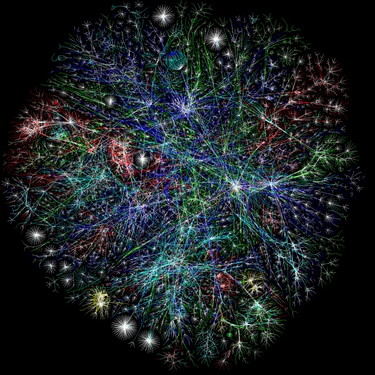

:::: {.hero}
::: {.hero-text}

::: {.hero-name role="heading" aria-level="1"}

:::

::: {.role}

:::

> Helping researchers get the design, analysis and interpretation right.

Statistician and biostatistics educator in the . I teach statistical methods to postgraduate and PhD researchers, and consult on the design and analysis of clinical and biomarker studies.

This site is my public notebook: *how I learnt, what I learnt*.

::: {.chips}
[10+ years in biostatistics]{.chip} [R · Python · SPSS · Stata · SAS]{.chip} [MSc and PhD teaching]{.chip}
:::

::: {.hero-links}
[GitHub](){.btn .btn-outline-primary .btn-sm}
[CV](cv.qmd){.btn .btn-outline-primary .btn-sm}
<!-- Add these as you create the profiles:
[Scholar](https://scholar.google.com/citations?user=YOUR-ID){.btn .btn-outline-primary .btn-sm}
[LinkedIn](https://www.linkedin.com/in/YOUR-HANDLE/){.btn .btn-outline-primary .btn-sm}
[ORCID](https://orcid.org/0000-0000-0000-0000){.btn .btn-outline-primary .btn-sm}
-->
:::

:::

::: {.hero-photo}
{fig-alt="A network graph of coloured lines radiating from dense hubs, a map of internet connections."}
:::
::::

---

## Academic profile

::: {.tiles}

::: {.tile}
### [🔬 Research](research.qmd)
Agreement and reliability, biomarker accuracy, trial design and survival analysis.
:::

::: {.tile}
### [📖 Publications](publications.qmd)
Journal articles, reports and preprints.
:::

::: {.tile}
### [🎤 Conferences](conferences.qmd)
Talks, posters and workshops.
:::

:::

## Professional work

::: {.tiles}

::: {.tile}
### [💻 Software](software.qmd)
R functions and packages for everyday analysis.
:::

::: {.tile}
### [📊 Experience](experience.qmd)
Teaching, statistical consultancy and research support.
:::

::: {.tile}
### [🎓 Teaching](teaching.qmd)
Courses and workshops for postgraduate and PhD researchers.
:::

:::

## Writing

::: {.tiles}

::: {.tile}
### [🗒️ Notes](notes.qmd)
Reference notes and link collections I want to be able to find again.
:::

::: {.tile}
### [✍️ Blog](blog.qmd)
Longer posts on data wrangling, bootstrapping and how I learnt them.
:::

:::
